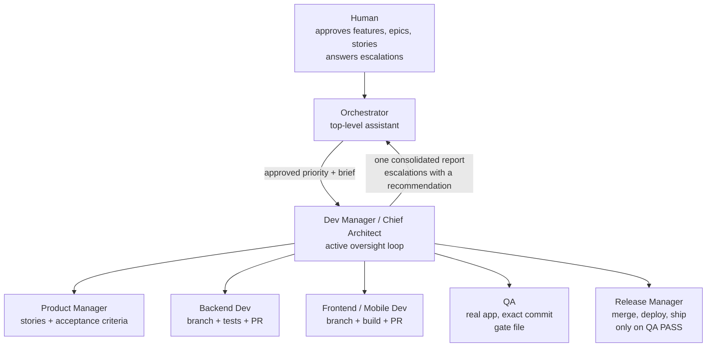

# Agent Dev Team Blueprint

A harness-neutral blueprint for running an **autonomous AI software development team**: an orchestrator, a dev manager who is also the chief architect, a product manager, backend and frontend/mobile developers, QA, and a release manager, plus the rules and patterns that let them build and ship approved work without a human steering every step.

> **Installing? Read [`INSTALL.md`](INSTALL.md) first.** Your existing main assistant (for example "Jarvis") becomes the orchestrator. The install never creates a second orchestrator or primary assistant and never overwrites your existing agents.


It is extracted from a setup that has shipped real epics end to end (backend deploys, mobile builds to test groups, data migrations) under these rules, then generalized. Every rule here exists because something broke without it. The deepest material is about the **dev manager**, because that role is what makes the whole thing work, and it is the role that failed in the most instructive ways.

Docs and agent definitions only. No product code, no infrastructure scripts: the supporting machinery (run queue, usage guard, resume watcher, occupancy lock, heartbeat) is described as patterns with small illustrative snippets.

## The org chart



Plain text version:

```
Human -> Orchestrator -> Dev Manager -> { Product Manager, Backend Dev, Frontend/Mobile Dev, QA, Release Manager }
```

## How it works in one paragraph

The human approves work at the feature, epic, or story level, after the orchestrator has thought it through and asked every shaping question up front with recommended defaults. The orchestrator hands the approved priority to the dev manager and **steps back**. The dev manager decomposes it, runs at most two dev streams in separate git worktrees, **verifies every handback against the real artifact**, reviews every PR for architecture drift, and **drives each item through QA and release until it is shipped and verified**, or until it hits a genuine human gate (compliance, real-user data, spend, irreversible), which it escalates with a recommendation while the rest of the team keeps working. Nothing ships without a QA PASS for that exact commit. Long runs survive pauses and crashes through a durable state file, a usage guard, and a resume watcher.

## What is in here

```
AGENTS.md                      universal entry point (any harness reads this)
CLAUDE.md                      Claude Code entry (imports AGENTS.md)
roles/                         SINGLE SOURCE OF TRUTH for every role
  _shared-rules.md             the team rules appended to every role
  orchestrator.md
  dev-manager.md               the deepest file: read this one first
  product-manager.md  backend-dev.md  frontend-dev.md  qa.md  release-manager.md
principles/
  working-rules.md             each rule and why it exists
  autonomy-and-gates.md        approval levels and the hard gates
  manager-lessons.md           twenty failures and the rule each produced
  budget-and-resume.md         pausing and resuming without losing work
  parallel-work.md             worktrees, WIP limits, shared resources
patterns/
  state-file.md  usage-guard.md  resume-watcher.md  run-queue.md
  handoff-protocol.md  qa-gate.md  escalation.md  occupancy-lock.md  heartbeat.md
  templates/  STATE.md  ESCALATION.md  ADR.md  BRIEF.md  DISPATCH.md
examples/epic-walkthrough.md   one epic from request to shipped, including what goes wrong
docs/harnesses.md              per-harness formats, with links to the official docs
docs/naming.md                 optional call-sign flavor
codex/README.md                running on OpenAI Codex
scripts/build_adapters.py      regenerates every adapter from roles/
.claude/agents/                GENERATED Claude Code subagents
.github/agents/                GENERATED GitHub Copilot custom agents
.github/copilot-instructions.md, .github/prompts/   Copilot instructions and prompt files
.codex/agents/                 GENERATED Codex custom agents
```

## Quick start

1. Copy into your product repo: `AGENTS.md`, `CLAUDE.md`, `roles/`, `principles/`, `patterns/`, `scripts/`, and the harness folders you use (`.claude/`, `.github/`, `.codex/`).
2. Replace `ExampleApp` in `roles/*.md` with your product, and add your product's non-negotiables (data isolation rules, compliance lines, stack facts) to the relevant role files.
3. Regenerate: `python3 scripts/build_adapters.py`.
4. Create an assignment folder **outside** the repo working tree for `BRIEF.md` and `STATE.md` (templates in `patterns/templates/`).
5. Pick your harness below.

### Claude Code

- Start Claude Code in the repo. The main session is the orchestrator (`CLAUDE.md`).
- Ask for the work, answer its batched questions, approve. It dispatches `dev-manager`, which dispatches the team.
- Make sure the dev manager dispatches its team in the foreground (it is written that way) and that its agent file has no `tools` line (inherits all tools, including the one that spawns agents).
- For unattended runs, launch the manager headless from a run queue with a "resume the assignment" prompt and add the resume watcher.

### GitHub Copilot (running Claude Opus 5.5)

- The custom agents are in `.github/agents/`; repository instructions in `.github/copilot-instructions.md`; Copilot also reads `AGENTS.md`.
- Select Claude Opus 5.5 in Copilot's model picker (the agent files carry no model line, so they use your selection). See `docs/harnesses.md` to pin it.
- Select the `dev-manager` agent and run the `run-approved-epic` prompt file, or describe the approved work. Use `resume-assignment` to continue from `STATE.md`.
- If your Copilot surface cannot invoke custom agents from another agent, use the flattened topology below.

### OpenAI Codex

- Codex reads `AGENTS.md` and the custom agents in `.codex/agents/`.
- Run Codex as the dev manager and let it spawn the team. Recipe: `codex/README.md`.

### Flattened topology (any harness without nested agents)

If your harness cannot have an agent spawn other agents, the human plays the orchestrator and talks to the dev manager directly, and the dev manager either spawns role agents (if one level is allowed) or the human runs each role session in turn while the dev-manager session reviews, verifies, and decides what runs next. The rules do not change: one writer per checkout, verification of every handback, QA gate before ship.

## The rules that matter most

1. The orchestrator talks only to the dev manager and stays out of the team's way.
2. The dev manager runs an active oversight loop, verifies every handback, and never returns while a subagent is in flight.
3. QA before ship is absolute, bound to the exact commit.
4. Never two developers in one checkout; at most two dev streams.
5. Approval at the feature/epic/story level authorizes build, merge, and ship; hard gates only at compliance, real-user data, spend, and irreversible actions.
6. Evidence only. Words match actions. No promise without a mechanism.

The full list with reasons: `principles/working-rules.md`. The failures behind the manager rules: `principles/manager-lessons.md`.

## Editing roles

Edit `roles/*.md` only, then run `python3 scripts/build_adapters.py`. CI (`.github/workflows/check-adapters.yml`) fails if a generated adapter drifts from its source or if an em dash or en dash slips in.

## License

MIT. See `LICENSE`.
